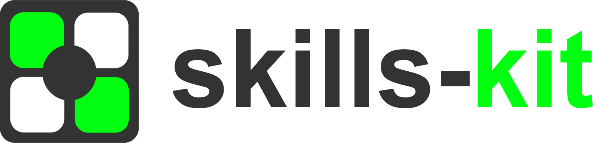

<div align="center">


# skills-kit

**Create AI skills once, run them everywhere.**

[](LICENSE)
[](https://www.typescriptlang.org/)
<a href="https://discord.gg/wwYpdTPCPR" alt="Discord">
        
</a>

[Quick Start](#quick-start) · [Examples](#examples)

</div>

---

Skills are portable AI capabilities. Define inputs, write logic, test once — then use with Claude, GPT, Gemini, or any MCP-compatible agent. No vendor lock-in.

---

## Quick Start

```bash
# Install
npm install -g @skills-kit/cli

# Create a skill
skills-kit init my-skill

# Validate & test
skills-kit lint my-skill && skills-kit test my-skill

# Serve via MCP
skills-kit serve my-skill --port 3000
```

Use with any LLM:

```typescript
import { MCPClient, MCPAgent } from 'mcp-use';
import { ChatOpenAI } from '@langchain/openai';

const client = MCPClient.fromDict({
  mcpServers: { skills: { url: 'http://localhost:3000/sse' } }
});

const agent = new MCPAgent({
  llm: new ChatOpenAI({ model: 'gpt-4o' }),
  client
});

await agent.run('Use my-skill to do something');
```

## What's a Skill?

```
my-skill/
├── SKILL.md        # Schema + docs (inputs, outputs, metadata)
├── policy.yaml     # Permissions (network, fs, exec)
├── scripts/run.cjs # Your logic (JSON in → JSON out)
└── tests/golden.json
```

Skills receive JSON via stdin, return JSON via stdout. Language-agnostic. Easy to test.

## Features

| | |
|---|---|
| 🔌 **MCP Native** | Works with any MCP client out of the box |
| 📁 **File Processing** | PDFs, images, CSVs with compression & streaming |
| 🧪 **Golden Tests** | Validate skills before deployment |
| 🤖 **AI Generation** | Create skills from natural language |
| 📦 **Bundling** | Package for npm or custom registries |
| 🔒 **Policies** | Declarative security permissions |

## CLI

```bash
skills-kit init <path>              # Create from template
skills-kit create "description"     # AI-generate skill
skills-kit lint <path>              # Validate
skills-kit test <path>              # Run golden tests
skills-kit serve <path> --inspector # MCP server + web UI
skills-kit bundle <path>            # Package for distribution
```

## MCP Integration

**With mcp-use:**

```typescript
const client = MCPClient.fromDict({
  mcpServers: { skills: { url: 'http://localhost:3000/sse' } }
});
```

**With Claude Desktop** (`claude_desktop_config.json`):

```json
{
  "mcpServers": {
    "skills": {
      "command": "skills-kit",
      "args": ["serve", "./my-skills", "--transport", "stdio"]
    }
  }
}
```

## Links

[Discord](https://discord.gg/wwYpdTPCPR) · [Contributing](./CONTRIBUTING.md) · [License](./LICENSE)

---

<div align="center">

**MIT © [Gabriele Karra](https://github.com/gabrielekarra)**

</div>
